# 内容概要

1. SpringMVC概述
2. SpringMVC的HelloWorld
3. 使用@RequestMapping映射请求
4. 映射请求参数&请求头
5. 处理模型数据
6. 视图和视图解析器
7. RESTful CRUD
8. SpringMVC表单标签&处理静态资源
9. 数据转换&数据格式化&数据校验
10. 处理JSON：使用HttpMessageCoverter
11. 国际化
12. 文件的上传
13. 使用拦截器
14. 异常处理
15. SpringMVC运行流程
16. 在Spring的环境下使用SpringMVC
17. SpringMVC对比Struts2


# SpringMVC概述

1. Spring为展现层提供的基于MVC设计理念的优秀的Web框架，是目前最主流的MVC框架之一。
2. Spring3.0后全面超越Struts2，成为最优秀的MVC框架。
3. SpringMVC通过一套MVC注解，让POJO称为处理请求的控制器，而无需实现任何接口。
4. 支持REST风格的URL请求
5. 采用了松散耦合可拔插组件结构，比其他MVC构架更具扩展性和灵活性。


# HelloWorld

## 加入jar包

```json
-- commons-logging-1.1.3.jar
-- spring-aop-4.0.0.RELEASE.jar
-- spring-beans-4.0.0.RELEASE.jar
-- spring-context-4.0.0.RELEASE.jar
-- spring-core-4.0.0.RELEASE.jar

-- spring-web-4.0.0.RELEASE.jar
-- spring-webmvc-4.0.0.RELEASE.jar
```

```xml
<!--单元测试-->
<!-- https://mvnrepository.com/artifact/junit/junit -->
<dependency>
    <groupId>junit</groupId>
    <artifactId>junit</artifactId>
    <version>4.12</version>
    <scope>test</scope>
</dependency>

<!--logging包-->
<!-- https://mvnrepository.com/artifact/commons-logging/commons-logging -->
<dependency>
    <groupId>commons-logging</groupId>
    <artifactId>commons-logging</artifactId>
    <version>1.1.1</version>
</dependency>


<!--spring核心包-->
<!-- https://mvnrepository.com/artifact/org.springframework/spring-context -->
<dependency>
    <groupId>org.springframework</groupId>
    <artifactId>spring-context</artifactId>
    <version>5.2.8.RELEASE</version>
</dependency>
<!-- https://mvnrepository.com/artifact/org.springframework/spring-core -->
<dependency>
    <groupId>org.springframework</groupId>
    <artifactId>spring-core</artifactId>
    <version>5.2.8.RELEASE</version>
</dependency>
<!-- https://mvnrepository.com/artifact/org.springframework/spring-beans -->
<dependency>
    <groupId>org.springframework</groupId>
    <artifactId>spring-beans</artifactId>
    <version>5.2.8.RELEASE</version>
</dependency>
<!-- https://mvnrepository.com/artifact/org.springframework/spring-expression -->
<dependency>
    <groupId>org.springframework</groupId>
    <artifactId>spring-expression</artifactId>
    <version>5.2.8.RELEASE</version>
</dependency>
<!--Spring框架一般都是基于AspectJ实现AOP操作-->
<!-- https://mvnrepository.com/artifact/org.springframework/spring-aspects -->
<dependency>
    <groupId>org.springframework</groupId>
    <artifactId>spring-aspects</artifactId>
    <version>5.2.8.RELEASE</version>
</dependency>


<!--MVC-->
<!-- https://mvnrepository.com/artifact/org.springframework/spring-web -->
<dependency>
    <groupId>org.springframework</groupId>
    <artifactId>spring-web</artifactId>
    <version>5.2.8.RELEASE</version>
</dependency>
<!-- https://mvnrepository.com/artifact/org.springframework/spring-webmvc -->
<dependency>
    <groupId>org.springframework</groupId>
    <artifactId>spring-webmvc</artifactId>
    <version>5.2.8.RELEASE</version>
</dependency>
```


## 在web.xml中配置DispathcerServlet

```xml
<!--配置DispatcherServlet-->
<servlet>
    <servlet-name>springDispatcherServlet</servlet-name>
    <servlet-class>org.springframework.web.servlet.DispatcherServlet</servlet-class>

    <!--配置DispatcherServlet 的一个初始化参数：配置SpringMVC 配置文件的位置和名称-->
        <!--实际上也可以不通过contextConfigLocation来配置SpringMVC的配置文件，而使用默认的
            默认的配置文件为：/WEB-INF/<servlet-name>-servlet.xml
        -->
    <!--<init-param>
        <param-name>contextConfigLocation</param-name>
        <param-value>classpath:springDispatcherServlet-servlet.xml</param-value>
    </init-param>-->
    <load-on-startup>1</load-on-startup>
</servlet>
<servlet-mapping>
    <servlet-name>springDispatcherServlet</servlet-name>
    <url-pattern>/</url-pattern>
</servlet-mapping>
```


## 加入Spring MVC的配置文件

```xml
<?xml version="1.0" encoding="UTF-8"?>
<beans xmlns="http://www.springframework.org/schema/beans"
       xmlns:xsi="http://www.w3.org/2001/XMLSchema-instance"
       xmlns:context="http://www.springframework.org/schema/context"
       xmlns:mvc="http://www.springframework.org/schema/mvc"
       xsi:schemaLocation="http://www.springframework.org/schema/beans http://www.springframework.org/schema/beans/spring-beans.xsd
                            http://www.springframework.org/schema/context http://www.springframework.org/schema/context/spring-context.xsd
                            http://www.springframework.org/schema/mvc http://www.springframework.org/schema/mvc/spring-mvc.xsd">

    <!--配置自动扫描的包-->
    <context:component-scan base-package="com.zh.springmvc"></context:component-scan>


    <!--配置视图解析器：如何把handler方法返回值解析为实际的物理视图-->
    <bean class="org.springframework.web.servlet.view.InternalResourceViewResolver">
        <property name="prefix" value="/WEB-INF/views/"></property>
        <property name="suffix" value=".jsp"></property>
    </bean>


</beans>
```


## 编写处理请求的处理器，并表示为处理器

```java
@Controller
public class HelloWorld {

    /**
     * 1. 使用 @RequestMapping 注解来映射请求的 URL
     * 2. 返回值会通过视图解析器解析为实际的物理视图，对于InternalResourceViewResolver 视图解析器，会做如下解析：
     *      通过：prefix + returnVal + 后缀 这样的方式得到实际的物理视图，然后做转发操作
     *
     *      /WEB-INF/views/success.jsp
     * @return
     */
    @RequestMapping("/helloworld")
    public String hello() {
        System.out.println("hello world");
        return "success";
    }

}
```


## 编写视图

```xml
<!--配置视图解析器：如何把handler方法返回值解析为实际的物理视图-->
<bean class="org.springframework.web.servlet.view.InternalResourceViewResolver">
    <property name="prefix" value="/WEB-INF/views/"></property>
    <property name="suffix" value=".jsp"></property>
</bean>
```


# 使用@RequestMapping映射请求

1. SpringMVC使用**@RequestMapping**注解未控制器指定可以处理哪些URL请求
2. 在控制器的类定义及方法处都可标注
   + RequestMapping
   + 类定义处：提供出部的请求映射信息。相当于WEB应用的根目录
   + 方法处：提供进一步的细分映射信息。相对于类定义处的URL。若类方法定义处未标注＠RequestMapping，则方法处标记的URL相对于WEB应用的根目录
3. DispatcherServlet截获请求之后，就通过控制器上**@RequestMapping**提供的映射信息确定请求所对应的处理方法。

4. 示例：

```java
@Controller
@RequestMapping("/springmvc")
public class SpringMVCTest {

    private static final String SUCCESS = "success";

    /**
     * 1. @RequestMapping除了修饰方法，还可以修饰类
     * 2. 类定义处：提供初步的请求映射信息，相对于 WEB应用的根目录
     * 3. 方法处：提供进一步的细分映射信息。相对于类定义出的URL。若类定义处未标注@RequestMapping，则方法出标记的URL相对于WEB应用的根目录
     * @return
     */
    @RequestMapping("/testRequestMapping")
    public String testRequestMapping() {
        System.out.println("SpringMVCTest.testRequestMapping");
        return SUCCESS;
    }

}
```

## 映射请求参数&请求头

### 标准的HTTP请求报头

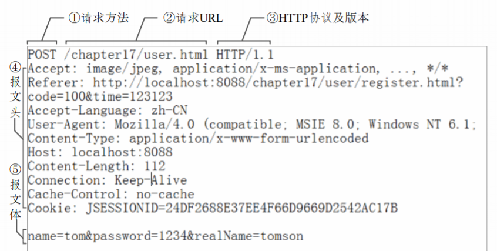

##  映射请求参数、请求方法或请求头 

1. @RequestMapping除了可以使用请求URL映射请求外，还可以使用请求方法、请求参数以及请求头映射请求。
2. @RequestMapping的value、method、params及heads分别表示请求URL、请求方法、请求参数及请求头的映射条件，他们之间是**与**的关系，联合使用多个条件可以让请求映射更加精确化。
3. params和headers支持简单的表达式：
   1. param1：表示请求必须包含名为param1的请求参数
   2. !param1：表示请求不能包含名为param1的请求参数
   3. param1!=value1：表示请求包含名为param1的请求参数，但其值不能为value1
   4. {"param1=value1", "param2"}：请求必须包含为param1和param2的两个请求参数，且param1参数的值必须为value1

## 使用@RequestMapping映射请求

1. Ant风格资源地址支持3种匹配符：
   + ? ：匹配文件名中的一种字符
   + \* ：匹配文件名中的任意字符
   + ** ：** 匹配多层路径
2. @RequestMapping还支持Ant风格的URL：
   + /user/*/createUser：匹配
     + /user/**aaa**/createUser、/user/**bbb**/createUser等URL
   + /user/**/createUser：匹配
     + /user/createUser、/user/**aaa/bbb/**createUser等URL
   + /user/createUser??：匹配
     + /user/createUser**aa**、/user/createUser**bb**等URL

## @PathVariable映射URL绑定的占位符

1. 带占位符的URL是Spring3.0新增的功能，该功能在SpringMVC向REST目标挺进发展过程种具有里程碑的意义
2. 通过@PathVariable可以将URL种占位符参数绑定到控制器处理方法的入参中：URL种的**{XXX}**占位符可以通过@PathVariable("xxx")绑定到操作方法的入参种。

```java
/**
 * @PathVariable 可以来映射URL中的占位符到目标方法的参数中。
 * @param id
 * @return
 */
@RequestMapping("/testPathVariable/{id}")
public String testPathVariable(@PathVariable("id") Integer id){
    System.out.println("SpringMVCTest.testPathVariable:" + id);
    return SUCCESS;
}
```


## REST

1. REST：即Represenetation State Transfer 。（资源）表现层状态转化。是目前最流行的一种互联网软件构架。它结构清晰、符合标准、易于理解、扩展方便，所以正得到越来越多的网站采用。
2. 资源（Resources）：网络上的一个实体，或者说是网络上的一个具体信息。它可以是一段文本、一张图片、一首歌曲、一种服务，总之就是一个具体的存在。可以用一个URL（统一资源定位符）指向它，每种资源对应一个特定的URL。要获取这个资源，访问它的URL就可以，因此URL即为每一个资源的独一无二的识别符。
3. 表现层（Representation）：把资源具体呈现出来，叫做他的表现层（Representation）。比如：文本可以用txt格式表现，也可以用html格式、xml格式、JSON格式表现，甚至可以采用二进制格式。
4. 状态转换（State Transfer）：每发出一个请求，就代表了客户端和服务器端的一次交互过程。HTTP协议，是一个无状态协议，即所有的状态都保存在服务器端。因此，如果客户端想要操作服务器，必须是哦通过某种手段，让服务器端发生“状态转化”（State Transfer）。而这种转化是建立在表现层之上的，所以就是“表现层状态转化”。具体说，就是HTTP协议里面，四个表示操作方式的动词：GET、POST、PUT、DELETE。他们分别对应四种基本操作：GET用来获取资源，POST用来新建资源，PUT用来更新资源，DELETE用来删除资源。
5. 示例：
   1. -/order/1 HTTP GET ：得到id=1的order
   2. -/order/1 HTTP POST：删除id=1的order
   3. -/order/1 HTTP PUT：更新id=1的order
   4. -/order HTTP POST：新增order
6. HiddenHttpMethodFilter：浏览器form表单只支持GET与POST请求，而DELETE、PUT 等method并不支持，Spring3.0添加了一个过滤器，可以将这些请求转化为标准的HTTP方法，使得支持GET、POST、PUT与DELETE请求


## @PathVariable 绑定URL占位符到入参

1. 带占位符的URL是Spring3.0新增的功能，该功能在SpringMVC向REST目标挺进发张过程中具有里程碑的意义

2. 通过@PathVariable 可以将 URL 中占位符参数绑定到控制器处理方法的入参中：URL中的**{XXX}**占位符可以通过@PathVariable("xxx")绑定到方法的入参中。

3. ```java
   @RequestMapping("/delete/{id}")
   public String delete(@PathVariable("id") Integer id) {
       UserDao.delete(id);
       return "redirect:/user/list.action";
   }
   ```

# 映射请求参数&请求参数


## 请求处理方法签名

1. Spring MVC 通过分析处理方法的签名，将HTTP请求信息绑定到处理方法的相应入参中。
2. Spring MVC 对控制器处理方法签名的限制是很宽松的，几乎可以按喜欢的任何方式对方法继续进行签名。
3. 必要时可以对方法及方法入参标注相应的注解（@PathVariable、@RequestParam、@RequestHeader 等）、Spring MVC框架会根据HTTP请求的信息绑定到相应的方法入参中，并根据方法的返回值类型做出相应的后续处理。


## 使用@RequestParam绑定请求参数值

1. 在处理方法处使用 @RequestParam 可以把请求参数传递给请求方法
   
   1. value：参数名
   2. requird：是否必须。默认为true,表示请求从参数中必须包含对应的参数，若不存在，将抛出异常。
   
2. ```java
   @RequestMapping("/handle5")
   public String handle5(@RequestParam(value="username", required=false) String uernName, @RequestParam("age") int age) {
       return "success";
   }
   ```


## 使用@RequestHeader绑定请求报头的属性值

1. 请求头包含若干个属性，服务器可据此获知客户端的信息，通过@RequestHeader 即可将请求头中的属性值绑定到处理方法中的入参中。

2. ```java
   @RequestMapping("/handle7")
   public String handle7(@RequestHeader("Accept-Encoding") String encoding, @RequestHeader("Keep-Alive") long keeppAlieve) {
       return "success";
   }
   ```


## 使用@CookieValue绑定请求中的Cookie值

1. @CookieValue可以让处理方法入参绑定某个Cookie值。

2. ```java
   @RequestMapping("/handle6")
   public String handle6(@CookieValue(value="sessionId", required=false) String sessionId, @RequestParam("age") int age) {
       return "success";
   }
   ```


## 使用POJO对象绑定请求参数值

1. Spring MVC对安请求参数名和POJO属性名进行自动匹配，自动为该对象填充属性值。支持级联属性。

2. 如：dept.deptId、dept.address.tel等

3. ```java
   @RequestMapping("/handle8")
   public String handle8(User user) {
       System.out.println(user);
       return "success";
   }
   ```

4. `/handle8.action?userName=zh&dept.deptId=1&dept.address.tel=234525`


## 使用ServletAPI 作为入参

```java
@RequestMapping("/handle9")
public void handle9(HttpServletRequest request,HttpServletResponse response) {
    // ...
}

@RequestMapping("/handle10")
public ModelAndView handle10(HttpServletRequest request) {
    ModelAndView mv = new ModelAndView();
    // ...
    return mv;
}

@RequestMapping("/handle11")
public String handle11(HttpSession session) {
    // ...
    return "success";
}

@RequestMapping("/handle12")
public String handle12(HttpServletRequest request, @RequestParam("username") String userName) {
    // ...
    return "success";
}
```


### MVC 的handler 方法可以接搜哪些ServletAPI类型的参数、

1. HttpServletRequest
2. HttpServletResponse
3. HttpSession
4. java.security.Principal
5. Locale
6. InputStream
7. OutputStream
8. Reader
9. Writer


# 处理模型数据

> Spring MVC 提供一下几种途径输出模型数据
1. ModeAndView：处理方法返回值类型为ModelAndView时，方法体即可通过该对象添加模型数据
2. Map及Model：入参为 org.springframework.ui.Model、org.springframework.ui.ModelMap或java.util.Map时。处理方法返回时，Map中的数据会自动添加到模型中。
3. @SessionAttributes：将模型中的某个属性暂存到HttpSession中，以便多个请求之间可以共享这个属性。
4. @ModelAttribute：方法入参标注该注解后，入参的对象就会放到数据模型中。


## ModelAndView

1. 控制器处理方法的返回值如果为ModelAndView，则其既包含视图信息，也包含模型数据信息。

2. 添加模型数据：
   1. ModelAndView addObject(String attributeName, Object attributeValue)
   2. ModelAndView addAllObject(Map<String, ?> modelMap)
3. 设置视图
   1. void setView(View view)
   2. void setViewName(Sting viewName)


## Map及Model

1. Spring MVC在内部使用了一个 org.springframework.ui.Model接口存储模型数据
2. 具体步骤：
   1. Spring MVC 在调用方法前会创建一个隐含的模型对象作为模型数据的存储容器。
   2. 如果方法的入参为Map或Model类，Spring MVC 会将隐含模型的引用传递给这些入参。在方法体内，开发者可以通过这个入参访问到模型中的所有数据，可以向模型中添加新的属性数据。

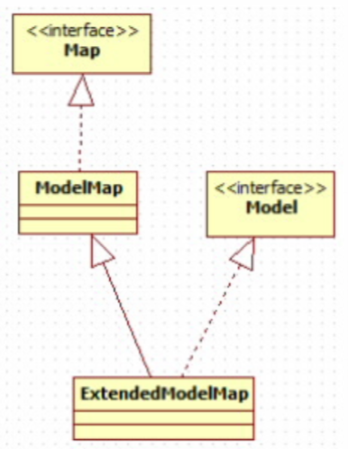

3. Map及Model示例
   1. ```java
    @ModelAttribute("user")
      public User getUser() {
          User user = new User();
          user.setAge(10);
          return user;
      }
      
      @RequestMapping("/handle20")
      public String handle20(Map<String, Object> map) {
          map.put("time", new Date());
          User user = (User)map.get("user");
          user.setEmail("TongGang");
      	return "success";
      }
      ```
      
   2. ```jsp
       email:${requestScope.user.email}
       <br><br>
       time:${requestScope.time}
       <br><br>
       ```


## @SessionAttributes

1. 若希望在多个请求之间共用某个模型属性数据，则可以在控制器类上标注一个 @SessionAttribute，Spring MVC将在模型中对应的属性暂存到HttpSession中。

2. @SessionAttributes处理可以通过属性名指定需要放到会话中的属性外，还可以通过模型属性的对象模型指定哪些模型属性需要放到会话中，

   1. @SessionAttributes(types=User.class)会将隐含模型中的所有类型为User.class的属性添加到会话中。
   2. @SessionAttributes(value={"user1", "user2"})
   3. @SessionAttributes(types={User.class, Dept.class})
   4. @SessionAttributes(value={"user1", "user2"}, type={Dept.class})

3. @SessionAttribute示例

   1. ```java
      @SessionAttributes("user")
      @Controller
      @RequestMapping("/hello")
      public class HelloWorld() {
          
          @ModelAttribute("user")
          public User getUser() {
              User user = new User();
              user.setAge(10);
              return user;
          }
          
          @RequestMapping("/handle21")
          public String handle21(@ModelAttribute("user") User user) {
              user.setAge(22);
              return "redirect:/hello/handle22.action";
          }
          
          @RequestMapping("/handle22")
       	public String handle22(Map<String, Object> map, SessionStatus sessionStatus) {
              User user = (User)map.get("user");
              user.getId(200);
              return "success";
          }   
          
      }
      ```


## @ModelAttribute

1. 在方法定义上使用@ModelAttribute注解：Spring MVC在调用目标处理方法前，会先调用在方法级上标注了@ModelAttribue的方法。
2. 在方法的入参前使用@ModelAttribute注解：
   
    1. 可以从隐含对象中获取隐含的模型数据中获取对象，再将请求参数绑定到对象中，再传入入参。
    2. 将方法入参对象添加到模型中。

## 由@SessionAttribute引发的异常

> org.springframework.web.HttpSessionRequiredException:Session attribute 'user' required-not found in session

1. 如果在处理类定义出标注了@SessionAttributes("xxx")，则尝试从会话中获取该属性，并将其赋给该入参，然后再用请求消息填充该入参对象。如果在会话中找不到对应的属性，则抛出HttpSessionRequiredException异常

2. ```java
    bindObject = this.sessionAttributeStore.retrieveAttribute(webRequest,name);
    if(bindObject == null) {
        raiseSessionRequiredException("Session attribute'" + name + "' required - not found in session")
    }
    ```

### 如何避免@SessionAttribute引发的异常

```java
@Controller
@RequestMapping("/user")
@SessionAttribues("user")
public class UserController {
    @ModelAttribute("user")
    public User getUser() {
        // 该方法会忘隐含模型中添加一个名为user的模型属性
        User user = new User();
        return user;
    }

    @RequestMapping(value = "/handle71")
    public String handle71(@ModelAttribute("user") User user) {
        // ...
    }

    @RequestMapping(value = "/handle72")
    public String handle72(ModelMap modelMap, SessionStatus sessionStatus) {
        // ...
    }
}
```

# 视图和视图解析器

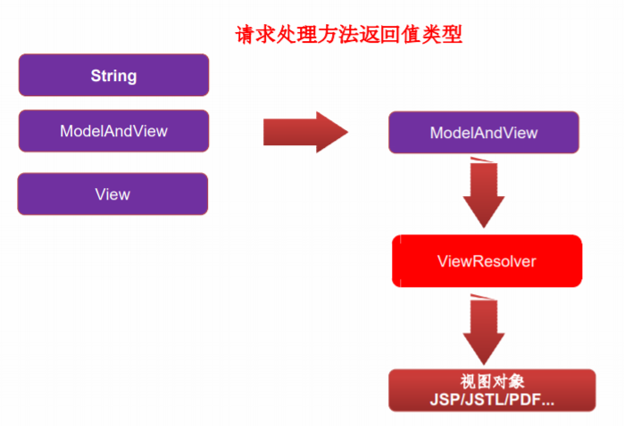


1. 请求处理方法执行完成后，最终返回一个ModelAndView对象，对于那些返回String，View或ModeMap等类型的处理方法，Spring MVC也会在内部将他们装配成一个ModelAndView对象，它包含了逻辑名和模型对象的视图。
2. Spring MVC借助视图解析器（ViewResolver）得到最终的视图对象（View），最终的视图可以是JSP，也可能是Excel、JFreeChart等各种表现形式的视图
3. 对于最终究竟采取何种视图对象对模型数据进行渲染，处理器并不关心，处理器的工作重点聚焦在生产模型数据的工作上，从而实现MVC的充分解耦。

##    视图

1. 视图的作用是渲染模型数据，将模型里的数据以某种形式呈现给客户。
2. 为了实现视图模型和具体实现技术的解耦，Spring在`org.springframework.web.servlet`包中定义了一个高度抽象的View接口。

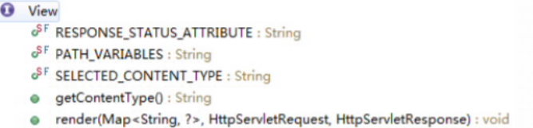

3. 视图对象由视图解析器负责实例化。由于视图是无状态的，所以他们不会有线程安全的问题。

## 常用的视图实现类

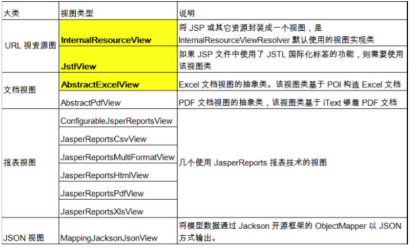

## 视图解析器

1. Spring MVC为逻辑视图名的解析提供了不同的策略，可以在Spring WEB上下文中配置一种或火种解析策略，并制定他们之间的先后顺序。每一种映射策略对应一个具体的视图解析器实现类。
2. 视图解析器的作用比较单一：将逻辑视图解析为一个具体的视图对象。
3. 所有的视图解析器都必须实现ViewResolver接口：


## 常用的视图解析器实现类

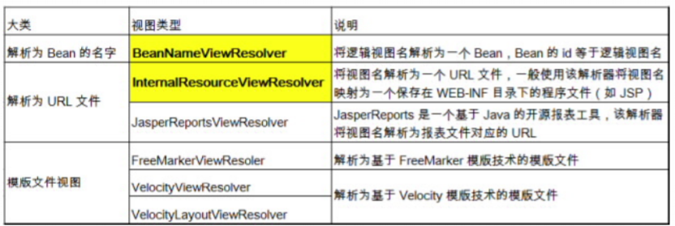

1. 程序员可以选择一种视图解析器或混用多种视图解析器。
2. 每个视图解析器都实现了Ordered接口并开放出一个order属性，可以通过order属性指定解析器的优先顺序，order越小优先级越高。
3. Spring MVC 会按照视图解析器顺序的优先顺序对逻辑视图名进行解析，知道解析成功并返回视图对象，否则将抛出ServletException异常。

## InternalResourceViewResolver

1. JSP 最常见的视图技术，可以使用InternalResourceViewResolver作为视图解析器：

2. ```xml
   <bean class="org.springframework.web.servlet.view.InternalResourceViewResolver">
   	<property name="prefix" value="/WEB-INF/pages/"></property>
       <property name="suffix" value=".jsp"></property>
   </bean>
   ```

3. 若项目中使用了JSTL，则Spring MVC 会自动把视图由InternalResourceView转为JstlView

4. 若使用JSTL的fmt标签则需要在Spring MVC的配置文件中配置国际化资源文件

   1. ```xml
      <bean id="messageSource" class="org.springframework.context.support.ResourceBundleMessageSource">
      	<property name="basename" value="i18n"></property>
      </bean>
      ```

5. 若希望直接响应通过Spring MVC渲染的页面，可以使用 MVC:view-controller 标签实现

   1. ```xml
      <mvc:view-controller path="springmvc/testJstlView" view-name="success"/>
      ```


## Excel视图

1. 若希望使用Excel展示数据列表，仅需要扩展Spring MVC提供的AbstractExcelView或AbstractJExcel View即可。实现buildExcelDocument()方法，在方法中使用模型数据对象构建Excel文档就可以了。
2. AbstractExcelView 基于POI API，而AbstractJExcelView是基于JExcelAPI的。
3. 视图对象需要配置IOC容器中的一个Bean，使用BeanNameViewResolver作为视图解析器即可。
4. 若希望直接在浏览器中直接下载Excel文档，则可以设置响应头 Content-Disposition的值为 attachment;filename=xxx.xls


## 关于重定向

1. 一般情况下，控制器方法返回字符串类型的值会被当成逻辑视图名处理。
2. 如果返回的字符串中带forward: 或 redirect: 前缀时，Spring MVC会对他们进行特殊处理：将forward: 和redirect: 当成指示符，最后的字符串将作为URL来处理。
   1. redirect: success.jsp：会完成一个到 success.jsp的重定向的操作
   2. forward: success.jsp：会完成一个到success.jsp的转发操作

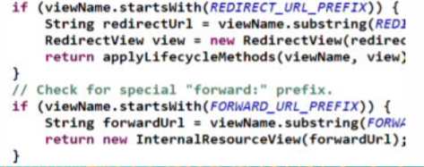


# RESTful CRUD

1. 添加员工信息：

   1. URL：emp

   2. 请求方式：POST

2. 删除操作：

   1. URL：emp/{id}
   2. 请求方式：DELETE

3. 显示信息

   1. URL：emp/{id}
   2. 请求方式：GET

4. 修改员工信息：

   1. URL：emp
   2. 请求方式：PUT

```xml
<!-- 配置HiddenHttpMethodFilter ：把post请求转为DELETE、PUT请求 -->
<filter>
    <filter-name>HiddenHttpMethodFilter</filter-name>
    <filter-class>org.springframework.web.filter.HiddenHttpMethodFilter</filter-class>
</filter>
<filter-mapping>
    <filter-name>HiddenHttpMethodFilter</filter-name>
    <url-pattern>/*</url-pattern>
</filter-mapping>
```


# Spring MVC表单标签

> 通过Spring MVC的表单标签可以实现将数据模型数据中的属性和HTML表单元素相绑定，已实现表单数据更便捷编辑和表单值的回显。

## form标签

1. 一般情况下，通过GET请求获取表单页面，而通过POST请求提交表单页面，因此获取表单页面和提交表单页面的URL是相同的。只需要满足该最佳条件的契约，\<form:form\> 标签就无需通过action属性指定表单提交的URL。
2. 没有通过modelAttribute属性指定绑定的模型属性，若没有指定该属性，则默认从request域对象中读取command的表单bean，如果该属性值也不存在，则会发生错误。

## 表单标签

1. Spring MVC提供了多个表单组件标签，如：\<form:input/>、\<form:select/>等，用以绑定表单字段的属性值，它们的共有属性如下。
   1. path：表单字段，对应html元素的name属性，支持级联属性
   2. htmlEscape：是否对表单值的HTML特殊字符进行转换，默认值为true.
   3. cssClass：表单组件对应的CSS样式类名
   4. cssErrorClass：表单组件的数据存在错误时，采取的css样式。
2. form:input 、form:password、form:hidden 、form:textarea ：对应HTML表单的text、password、hidden、textarea标签。
3. form:radiobutton: 单选框组件标签，当表单bean对应的属性值和value值相等时，单选框被选中。
   1. items：可以是一个List、String[] 或 Map
   2. itemValue：指定radio的value值。可以是集合中bean的一个属性值。
   3. itemLabel：指定radio的label值。
   4. delimiter：多个单选框可以通过delimiter指定分隔符
4. form:checkbox：复选框组件。用于构造单个复选框。
5. form:checkboxs：用于构造多个复选框。使用方式同form:radioButtons标签
6. form:select：用于构造下拉框组件。使用方式同form:radioButtons标签。
7.  form:option：下拉框选项组件标签。使用方式同 form:radiobuttons 标签 
8.  form:errors：显示表单组件或数据校验所对应的错误  
   1. \<form:errors path="*"/>：显示表单所有的错误 
   2. \<form:errors path="user*"/>：显示所有以user为前缀的属性对应的错误。
   3. \<form:errors path="username"/>：显示特定表单对象属性的错误。

# 处理静态资源

1. 优雅的REST风格的资源URL不希望带 .html 或 .do等后缀
2. 若将DispatcherServlet请求映射配置为 / ，则Spring MVC将捕获 WEB容器的所有请求，包括静态资源的请求，Spring MVC会将他们当成一个普通请求处理，因找不到对应处理器将导致错误。
3. 可以在Spring MVC的配置文件中配置`<mvc:defalut-servlet-handler/>`的方式解决静态资源的问题：
   1.  `<mvc:defalut-servlet-handler/>`将在 SpringMVC 上下文中定义一个 DefaultServletHttpRequestHandler，它会对进入 DispatcherServlet 的 请求进行筛查，如果发现是没有经过映射的请求，就将该请求交由 WEB 应用服务器默认的 Servlet 处理，如果不是静态资源的请求，才由 DispatcherServlet 继续处理 。
   2. 一般WEB应用服务器默认的Servlet的名称都是defalut。若所使用的WEB服务器的默认Servlet名称不是default，则需要通过defalut-servlet-name属性显示指定。

# 数据转换

## 数据绑定流程

1. Spring MVC主框架ServletRequest对象及目标方法的入参实例传递给WebDataBinderFactory实例，以创建DataBinder实例对象

2. DataBinder调用装配在Spring MVC上下文中的ConversionService组件进行数据类型转换、数据格式化工作。将Servlet中的请求信息填充到入参对象中。

3. 调用Validator组件对已经绑定了请求消息的入参对象进行数据合法性校验，并最终生成数据绑定结果BindingData对象。

4. Spring MVC抽取BindingResult中的入参对象和校验错误对象，将他们赋给处理方法的响应入参。

5. Spring MVC通过反射机制对目标处理方法进行解析，将请求消息绑定到处理方法的入参中。数据绑定的核心部件是DataBinder，运行机制如下：

6. 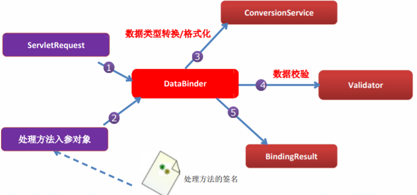

7. ```java
   WebDataBinder binder = binderFactory.createBinder(request, attribute, name);
   if (binder.getTarget() != null) {
       bindRequestParameters(binder, request);
       validataIfApplicable(binder, parameter);
       if (binder.getBindingResult().hasErrors()) {
           if (isBindExceptionRequired(binder, parameter)) {
               throw new BindException(binder.getBindingResult());
           }
       }
   }
   ```

8. Spring MVC 上下文中内创建了很多转换器，可完成大多数java类型的转换工作。

9. 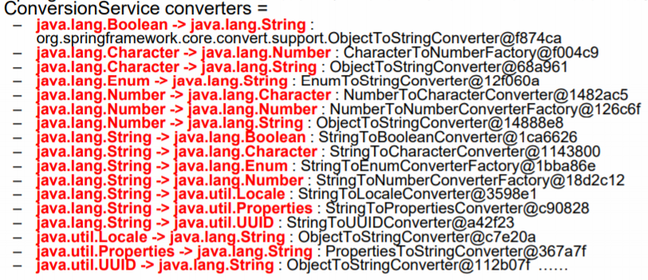


## 自定义类型转换器

1. ConversionService是Spring类型转换体系的核心接口。

2. 可以利用ConversionServiceFactoryBean在Spring的IOC容器中定义一个ConversionService，并在Bean属性配置及Spring MVC处理方法入参绑定等场合使用它进行数据转换。

3. 可通过ConversionServiceFactoryBean的converters属性注册自定义的类型转换器。

4. ```xml
   <bean id="conversionService" class="org.springframework.context.suppport.ConversionServiceFactoryBean">
   	<property name="converters">
       	<list>
           	<bean class="com.zh.springmvc.UserConverter"></bean>
           </list>
       </property>
   </bean>
   ```
5. 转换示例： 

6. ```java
   @Component
   public class UserConverter implements Converter<String, Employee> {
   
       @Override
       public Employee convert(String string) {
           // GG-gg@zh.com-0-105
           if (string != null) {
               String[] splits = string.split("-");
               if (splits != null && splits.length == 4) {
                   String lastName = splits[0];
                   String email = splits[1];
                   Integer gender = Integer.parseInt(splits[2]);
                   Department department = new Department();
                   department.setId(Integer.parseInt(splits[3]));
   
                   Employee employee = new Employee(null, lastName, email, gender, department);
                   System.out.println(string + "---UserConverter.convert---" + employee);
                   return employee;
               }
           }
           return null;
       }
   }
   ```


## Spring 支持的转换器

> Spring定义了3种类型的转换器接口，实现任意一个转换器接口斗可以定义为自定义转换器注册到ConversionServiceFactoryBean中：

1. Converter<S,T> ：将S类型对象转为T类型对象
2. ConverterFactory：将相同系列多个“同质”Converter封装在一起。如果希望将一种类型的对象转换为另一种类型及其子类的对象（例如将String转换为Number及Number子类（Integer、Long、Double等）对象）可使用该转换器工厂类。
3. GenericConverter：会根据源类对象及目标类对象所在的宿主类中的上下文信息进行转换。

## 自定义转换器示例

> <mvc:annotation-driven conversion-service="conversionService"/>会将自定义的ConversionService注册到Spring MVC的上下文中。

```xml
<mvc:annotation-driven conversion-service="conversionService"></mvc:annotation-driven>

<bean id="conversionService" class="org.springframework.context.support.ConversionServiceFactoryBean">
	<property name="converters">
    	<list>
        	<bean class="com.zh.springmvc.UserConverter"></bean>
        </list>
    </property>
</bean>
```

```java
@RequestMapping("/handle24")
public String handle24(@RequestParam("user") User user) {
    System.out.println(user);
    return "success";
}
```

```java
@Component
public class UserConverter implements Converter<String, Employee> {

    @Override
    public Employee convert(String string) {
        // GG-gg@zh.com-0-105
        if (string != null) {
            String[] splits = string.split("-");
            if (splits != null && splits.length == 4) {
                String lastName = splits[0];
                String email = splits[1];
                Integer gender = Integer.parseInt(splits[2]);
                Department department = new Department();
                department.setId(Integer.parseInt(splits[3]));

                Employee employee = new Employee(null, lastName, email, gender, department);
                System.out.println(string + "---UserConverter.convert---" + employee);
                return employee;
            }
        }
        return null;
    }
}
```

## 关于MVC:annotation-driven

1. \<mvc:annoation-driven />会自动注册RequestMappingHandlerMapping、RequestMappingHandlerAdapter与ExceptionHandlerExceptionResolver三个bean。
2. 还将提供一下支持：
   1. 支持使用ConversionService实例对表单参数进行类型转换。
   2. 支持使用@NumberFormat annotation、@DateTimeFormat注解完成数据类型的格式化。
   3. 支持使用@Valid注解对JavaBean实例进行JSR 303验证。
   4. 支持使用@RequestBody和ResponseBody注解。

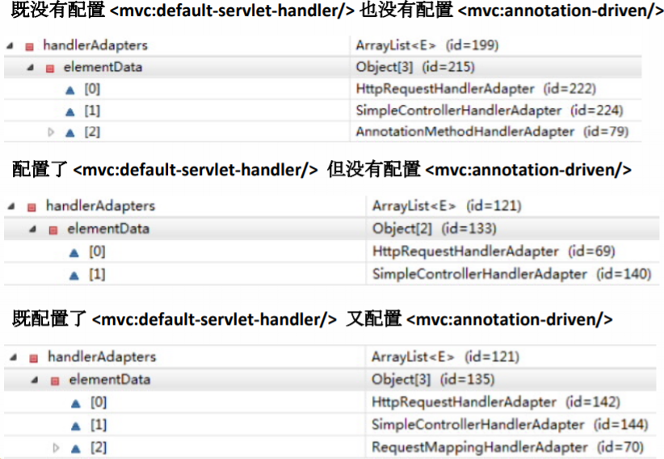

## @InitBinder

1. 由@InitBinder标识的方法，可以对WebDataBinder对象进行初始化。WebDataBinder是DataBinder的子类，用于完成由表单字段到JavaBean属性的绑定。

2. @InitBinder方法不能有返回值，他必须声明为void。

3. @InitBinder方法的参数通常是WebDataBinder

4. ```java
   @InitBinder
   public void initBinder(WebDataBinder databinder) {
       dataBinder.setDisallwedFields("roleSet");
   }
   ```


# 数据格式化

1. 对属性的输入/输出进行格式化，从其本质上讲依然属于“类型转换”的范畴。
2. Spring 在格式化模块中定义了一个实现ConversionService接口的FormattingConversionService实现类，该实现类扩展了GenericConversionService，因此他既有类型转换的功能，又具有格式化的功能。
3. FormattingConversionService拥有一个FormattingConversionServiceFactoryBean工厂类，后者用于在Spring上下文忠构造前者。
4. FormattingConversionServiceFactoryBean内部已经注册了：
   1. NumberFormatAnnotationFormatterFactory：支持对数字类型的属性使用@NumberFormat注解。
   2. JodaDateTimeFormatAnnotationFormatterFactory：支持对日期类型的属性使用@DateTimeFormat注解。
5. 装配了FormattingConversionServiceFactoryBean后，就可以在Spring MVC入参绑定及模型数据输出时使用注解驱动了。\<mvc:annotation-driven/>默认创建的ConversionService实例即为FormattingConversionServiceFactoryBean

## 日期格式化

> @DateTimeFormat注解可对java.util.Date、java.util.Calendar、java.long.Long事件类型进行标注：

1. pattern属性：类型为字符串。所制定解析/格式化字段数据的模式，如：“yyyy-MM-dd hh:mm:ss”
2. iso属性：类型为DateTimeFormat.ISO。指定解析/格式化字段数据的ISO模式，包括四种：ISO.NONE（不使用）-- 默认、ISO.DATE(yyyy-MM-dd)、ISO.TIME(hh:mm:ss.SSSZ)、ISO.DATE_TIME(yyyy-MM-dd hh:mm:ss.SSSZ)
3. style属性：字符串类型。通过样式指定日期时间的格式，有两位字符组成，第一位表示日期的格式，第二位表示时间的格式：S：短日期，M：中日期/时间格式，L：长日期/时间格式，F：完整日期/时间格式，-：忽略日期或时间格式。


## 数值格式化

> @NumberFormat可对类似数字类型的属性进行标注，它拥有两个互斥的属性：

1. style： 类型为 NumberFormat.Style。用于指定样式类 型，包括三种：Style.NUMBER（正常数字类型）、 Style.CURRENCY（货币类型）、 Style.PERCENT（ 百分数类型） 
2. pattern：类型为String，自定义样式，如patter="#,###"；


## 格式化示例

```xml
<mvc:annotation-driven></mvc:annotation-driven>
```

```java
public class User{
    
    @DateTimeFormat(patern="yyyy/MM/dd")
    private Date birthday;
}

@RequestMapping("/handle19")
public String handle19(@ModelAttribute("user") User user) {
    user.setId(1000);
    System.out.println(User);
    return "success";
}
```

# 数据校验

## JSR 303

1. JSR 303是java为Bean数据合法性校验提供的标准框架，他已经包含在JavaEE6.0中。
2. JSR 303通过在Bean属性上标注类似于@NotNull、@Max等标准的注解指定校验规则，并通过标准的验证接口对Bean进行验证

| 注解                       | 功能说明                                                 |
| -------------------------- | -------------------------------------------------------- |
| @Null                      | 被注释的元素必须是null                                   |
| @NotNull                   | 被注释的元素必须不为null                                 |
| @AssertTrue                | 被注释的元素必须为true                                   |
| @AssertFalse               | 被注释的元素必须为false                                  |
| @Min(value)                | 被注释的元素必须是一个数字，其值必须大于等于指定的最小值 |
| @Max(value)                | 被注释的元素必须是一个数字，其值必须小于等于指定的最大值 |
| @DecimalMin(value)         | 被注释的元素必须是一个数字，其值必须大于等于指定的最小值 |
| @DecimalMax(value)         | 被注释的元素必须是一个数字，其值必须小于等于指定的最大值 |
| @Size(max, min)            | 被注释的元素的大小必须在指定的范围内。                   |
| @Digits(Integer, fraction) | 被注释的元素必须是一个数字，其值必须在可接受的范围内     |
| @Past                      | 被注释的元素必须是一个过去的日期                         |
| @Future                    | 被注释的元素必须是一个将来的日期                         |
| @Pattern(value)            | 被注释的元素必须符合指定的正则表达式。                   |


## Hibernate Validator扩展注解

> Hibernate Validator是JSR 303的一个参考实现，除支持所有标准的校验注解外，它还支持一下的扩展注解

| 注解      | 功能说明                               |
| --------- | -------------------------------------- |
| @Email    | 被注释的元素必须是电子邮箱地址         |
| @Length   | 被注释的字符串的大小必须在指定的范围内 |
| @NotEmpty | 被注释的字符串的必须非空               |
| @Range    | 被注释的元素必须在合适的范围内         |


## Spring MVC数据校验

1. Spring  4.0拥有自己独立的数据校验框架，同时支持JSR 303标准的校验框架。

2. Spring在进行数据绑定时，可通过调用校验框架完成数据校验工作。在Spring MVC中，可直接通过注解驱动的方式进行数据校验。

3. Spring 的 LocalValidatorFactoryBean既实现了Spring的Validator接口，也实现了 JSR 303的Validator接口。只要在Spring容器中定义了一个LocalVaildatorFactoryBean，即可将其注入到需要数据校验的Bean中。

4. Spring 本身并没有提供JSR303的实现，所以必须将JSR303的实现者的jar包放到类路径下。

5. \<mvc:annotation-driven/>会默认装配好一个LocalValidatorFactoryBean，通过在处理方法的入参上标注@valid注解即可以让Spring MVC在完成数据绑定后执行数据校验的工作。

6. Spring MVC是通过对处理方法签名的规约来保存校验结果的：前一个表单/命令对象的校验结果保存到随后的入参中，这个保存校验结果的入参必须是BindingResult或Errors类型，这两个类都位于org.springframework.validation包中。

7. 需校验的Bean对象和绑定结果对象或错误对象时成对出现的，他们之间不需要声明其他的入参。

8. Errors接口体用了获取错误信息的方法，如getErrorCount()或getFieldErrors(String field)

9. BindingResult扩展了Errors接口

10. ```java
    public String handle(@Vaild User user, BindingResult userBindingResult, String sessionId, ModelMap mm, @Vaild Dept dept, Errors deptErrors) {}
    ```


## 在目标方法中获取校验结果

1.  在表单/命令对象类的属性中标注校验注解，在处理方法对 应的入参前添加 @Valid，Spring MVC 就会实施校验并将校 验结果保存在被校验入参对象之后的 BindingResult 或 Errors 入参中。 
2.  FieldError getFieldError(String field) 
3.  List getFieldErrors() 
4.  Object getFieldValue(String field) 
5.  Int getErrorCount() 

## 在页面上显示错误

1. Spring MVC除了会将表单/命令对象的校验结果保存到对应的BindingResult或Errors对象中外，还会将所有校验结果保存到“隐含模型”
2. 即使处理方法的签名中没有对应于表单/命令对象的结果入参，校验结果也会保存在“隐含对象”中。
3. 隐含模型中的所有数据最终将通过 HttpServletRequest 的属性列表暴露给JSP视图对象，因此在JSP中可以获取错误信息。
4. 在JSP页面上可通过 \<form:errors path="userName">显示错误消息

```jsp
<!-- index.jsp -->
<form:form action="hello/handle19.action" modelAttribute="user">
	<form:errors path="*"></form:errors>
    
    name: <input type="text" name="userName"/>
    <form:errors path="userName"></form:errors>
    
    email: <input type="text" name="email"/>
    <form:errors path="email"></form:errors>
    
    <input type="submit" value="Submit"/>
</form:form>
```

```java
// User
@DateTimeFormat(pattern="yyyy/MM/dd")
@Past
private Date birthday;

@NumberFormat(pattern="#,###.##")
@DecimalMax("9999")
@DecimalMin("1000")
private long salary;

@Pattern(regexp="\\w(4,30)")
private String userName;

@Email
private String email;
```

```java
// 目标方法
@RequestMapping("/handle19")
public String handle19(@Vaild @ModelAttribute("user") User user, BindingResult bindingResult) {
    if(bindingResult.hasErrors()) {
        return "forward:/index.jsp";
    }else {
        System.out.println("验证通过！");
    }
    user.setId(1000);
    System.out.println(user);
    return "success";
    
}
```

## 提示消息的国际化

1. 每个属性在数据绑定和数据校验发生时，都会生成一个对应的FieldError对象。

2. 当一个属性校验失败后，校验框架会为该属性生成4个消息代码，这些代码以校验注解类名为前缀，结合modleAttribute、属性名及属性类型名生成多个对应的消息代码：例如User类中的password属性标注了一个@Pattern所定义的规则时，就会产生一下4个错误代码：

   1. Pattern.user.password
   2. Pattern.password
   3. Pattern.java.lang.String
   4. Pattern

3. 当使用Spring MVC标签显示错误时，Spring MVC会查看WEB上下文是否装配了对应的国际化消息，如果没有，则显示默认的错误消息，否则使用国际化消息。

4. 若数据类型转换或数据格式转换时发生错误，或该有的参数不存在，或调用处理方法时发生错误，都会在隐含模型中创建错误消息。其错误代码前缀说明如下：

   1. required：必要的参数不存在。如：@RequiredParam("param1")标注了一个入参，但是该参数不存在。
   2. typeMismatch：在数据绑定时发生数据类型不匹配的问题
   3. methodInvocation：Spring MVC在调用处理方法时发生了错误

5. 注册国际化资源文件

6. ```xml
   <bean id="messageSource" class="org.springframework.context.support.ResourceBundleMessageSource">
   	<property name="basename" value=“i18n”></property>
   </bean>
   ```

# 处理JSON：使用HttpMessageConverter

## 处理JSON

1. 加入jar包

2. ```java
   <!--处理json-->
   <!-- https://mvnrepository.com/artifact/com.fasterxml.jackson.core/jackson-databind -->
   <dependency>
       <groupId>com.fasterxml.jackson.core</groupId>
       <artifactId>jackson-databind</artifactId>
       <version>2.10.0</version>
   </dependency>
   ```

3. 编写目标方法，使其返回JSON对应的对象或集合

4. 在方法上添加@ResponseBody注解

5. ```java
   @ResponseBody
   @RequestMapping("/getUsers")
   public List<User> testAjax() {
       List<User> users = new ArrayList<>();
       users.add(new User(1, "a", new Date(), 1000));
   	users.add(new User(2, "b", new Date(), 2000));
       return users;
   }
   ```


## HttpMessageConverter\<T>

1. HttpMessageConverter\<T>是Spring 3.0新添加的一个接口，负责将请求信息转换为一个对象（类型为T），将对象（类型为T）输出为响应信息

2. HttpMessageConverter\<T>接口定义的方法：

   1. Boolean canRead\(Class<?> clazz, MediaType mediaType)：指定转换器可以读取的对象类型，即转换器是否可将请求信息转换为clazz类型的对象，同时指定支持MIME类型（text/html, application/json等）
   2. Boolean canWrite\(Class<?> clazz, MediaType mediaType)：指定转换器是否可将clazz类型的对象写到响应流中，响应流支持的媒体类型在MediaType中定义。
   3.  T read\(Class<? extends T> clazz,HttpInputMessage inputMessage)： 将请求信息流转换为 T 类型的对象。 
   4.  void write(T t,MediaType contnetType,HttpOutputMessgae outputMessage):将T类型的对象写到响应流中，同时指定相应的媒体类 型为 contentType。 
   5. 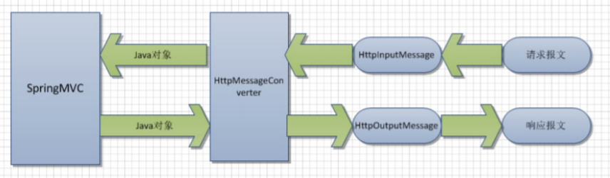

3. DispatcherServlet默认装配RequuestMappingHandlerAdapter，而RequestMappingHandlerAdapter默认装配如下：

   1. 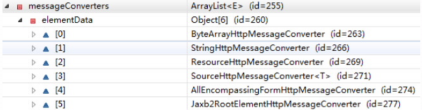
   2. 加入jacksonjar包之后，RequestMappingHandlerAdatper装配的HttpMessageConverter如下：
   3. 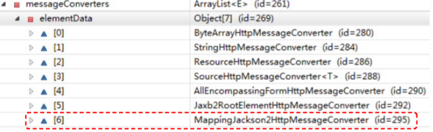

4. 使用HttpMessageConverter\<T>将请求信息转化并绑定到处理方法的入参中或将相应结果转为对应类型的响应信息，Spring提供了两种途径：

   1. 使用@RequestBody/@ResponseBody对处理方法进行标注
   2. 使用HttpEntity\<T>/ResponseEntity\<T>作为处理方法的如此那或返回值。

5. 当控制器处理方法使用到@RequestBody/@ResponseBody或HttpEntity\<T>/ResponseEntity\<T>时，Spring首先根据请求呕吐或响应头的Accept属性选择匹配的HttpMessageConverter，进而根据参数类型或泛型类型的过滤得到匹配的HttpMessageConverter，若找不到可用的HttpMessageConverter将报错。

6. @RequestBody和@ResponseBody不需要成对出现。

7. ```java
   @ResponseBody
   @RequestMapping("testHttpMessageConverter")
   public String testHttpMessageConverter(@RequestBody String body) {
       System.out.println(body);
   
       return "helloWorld " + new Date();
   }
   ```

### HttpMessageConverter\<T>的实现类

| 实现类                               | 功能说明                                                     |
| ------------------------------------ | ------------------------------------------------------------ |
| StringHttpMessageConverter           | 将请求信息转换为字符串                                       |
| FormHttpMessageConverter             | 将表单数据读取到MultiValueMap中                              |
| XmlAwareFormHttpMessageConverter     | 扩展与FormHttpMessageConverter，如果部分表单属性是XML数据，可用该转换器进行读取 |
| ResourceHttpMessageConverter         | 读写org.springframework.core.io/Resource对象                 |
| BufferedImageHttpMessageConverter    | 读写BufferedImage对象                                        |
| ByteArrayHttpMessageConverter        | 读写二进制数据                                               |
| SourceHttpMessageConverter           | 读写javax.xml.tranform.Source类型的数据                      |
| MarshallingHttpMessageConverter      | 通过Spring的org.springframework.xml.Marshaller和Unmarshaller读写xml消息 |
| Jaxb2RootElemengHttpMessageConverter | 通过JAXB2读写XML信息，将请求信息转换到标注XMLRootElement和XxmlType直接的类中 |
| MappingJacksonHttpMessageConverter   | 利用Jackson开源包的ObjectMapper读写JSON数据                  |
| RssChannelHttpMessageConverter       | 能够读写RSS种子消息                                          |
| AtomFeedHttpMeessageConverter        | 和RssChannelHttpMessageConverter能够读写RSS种子消息          |

# 国际化

## 国际化概述

1. 默认情况下，Spring MVC根据Accept-Language参数判断客户端的本地化类型。
2. 当接收到请求时，Spring MVC会在上下文中查找一个本地化解析器（LocalResolver），找到后使用它获取请求所对应的本地化类型信息。
3. Spring MVC还允许装配一个动态更改本地化类型的拦截器，这样通过指定一个请求参数就可以控制单个请求的本地化类型。

## SessionLocaleResolver&&LocaleChangeInterceptor工作原理

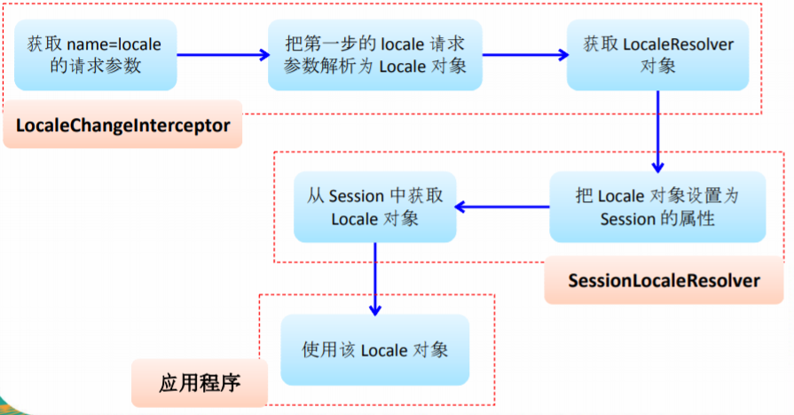

## 本地化解析器和本地化拦截器

1. AcceptHeaderLocaleResolver：根据Http请求头的Accept-Language参数确定本地化类型，如果没有显示定义本地化解析器，Spring MVC使用该解析器。
2. CookieLoacleResolver：根据指定的Cookie值确定本地化类型
3. SeesionLocaleResolver：根据Session中特定的属性确定本地化类型
4. LocaleChangeInterceptor：从请求参数中获取本次请求对应的本地化类型。

```xml
<bean id="localeResolver" class="org.springframework.web.servlet.i18n.SessionLocalResolver"></bean>

<mvc:interceptors>
	<bean class="org.springframe.web.servlet.i18n.LocaleChangeInterceptor"></bean>
</mvc:interceptors>
```

# 文件的上传

1. Spring MVC为文件上传提供了直接的支持，这种支持是通过即插即用的 MultipartResolver 实现的。Spring用Jakart Commons FileUpload技术实现了一个 MultipartResolver实现类：CommonsMultipartResolver

2. Spring MVC 上下文中默认没有装配MulitpartResolver，因此默认情况下不能处理文件的上传工作，如果想使用Spring 的文件上传功能，需先在上下文中配置MultipartResolver

3. defaultEncoding：必须和用户JSP的pageEncoding属性一致，以便正确解析表单的内容。

4. 为了让 CommonsMultipartResolver正确工作，必须先将Jakarta Commons FileUpload 及 Jakerta Commons io 的类包添加到类路径下。

5. ```xml
   <!--xml配置-->
   <bean id="multipartResolver" class="org.springframework.web.multipart.commons.CommonsMultipartResolver">
   	<property name="defaultEncoding" value="UTF-8"></property>
       <property name="maxUploadSize" value="1024000"></property>
   </bean>
   ```

6. ```jsp
   <!--jsp页面-->
   <form method="post" action="hello/upload.action" enctype="multipart/form-data">
       Desc: <input type="text" name="desc"/>
       File: <input type="file" name="file"/>
       <input type="submit" value="Submit">
   </form>
   ```

7. ```java
   @RequestMapping("/upload")
   public String upload(@RequestParam("desc") String desc, @RequestParam("file") MultipartFile file) throws Exception {
       if(!file.isEmpty()) {
           System.out.println("desc");
           file.transferTo(new File("d:\\temp\\" + file.getOriginalFilename()));
       }
       return "success";
   }
   ```


# 拦截器

## 自定义拦截器

> Spring MVC也可以使用拦截器队请求进行拦截处理，用户可以自定义拦截器来实现特定的功能，自定义的拦截器必须实现HandlerInterceptor 接口

1. preHandle()：这个方法在业务处理器处理请求之前被调用，在该方法中对用户请求request进行处理。如果程序员决定改拦截器对请求进行拦截处理后还要调用其他的拦截器，或者是业务处理器去进行处理，则返回true；如果程序员决定不需要再调用其他的组件去处理请求，则返回false。
2. postHandle()：这个方法在业务处理器处理完请求后，但是DispatcherServlet向客户端响应前被调用，在该方法中对用户请求request进行处理。
3. afterCompletion()：该方法在DispatcherServlet完全处理完请求后被调用。可以在该方法中进行一些资源清理的操作。

## 拦截器方法执行顺序

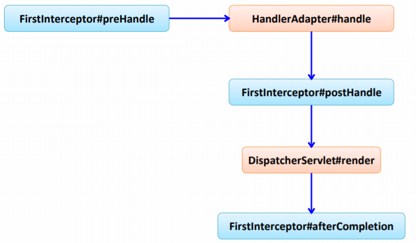

## 配置自定义拦截器

```xml
<mvc:interceptors>
	<!--拦截所有资源-->
    <bean class="com.zh.springmvc.interceptors.HelloInterceptor"></bean>
    <!--拦截指定资源-->
    <mvc:interceptor>
    	<mvc:mapping path="/emps"/>
        <bean class="com.zh.springmvc.interceptors.HelloInterceptors2"></bean>
    </mvc:interceptor>
    <bean class="org.springframework.web.servlet.i18n.LocaleChangeInterceptor"></bean>
</mvc:interceptors>
```

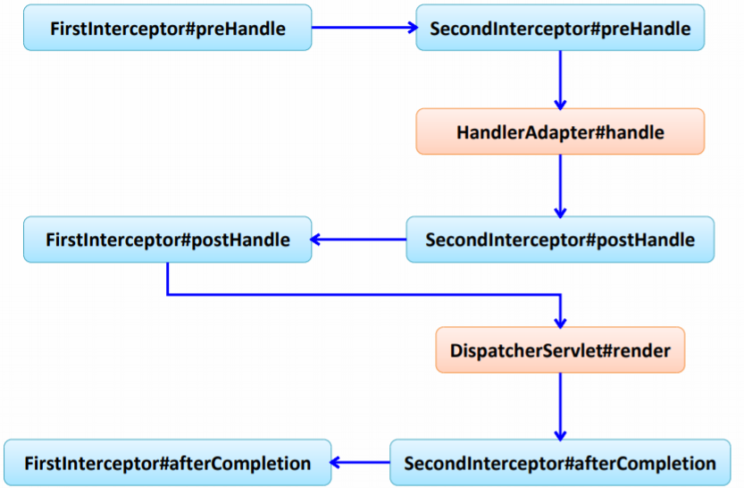

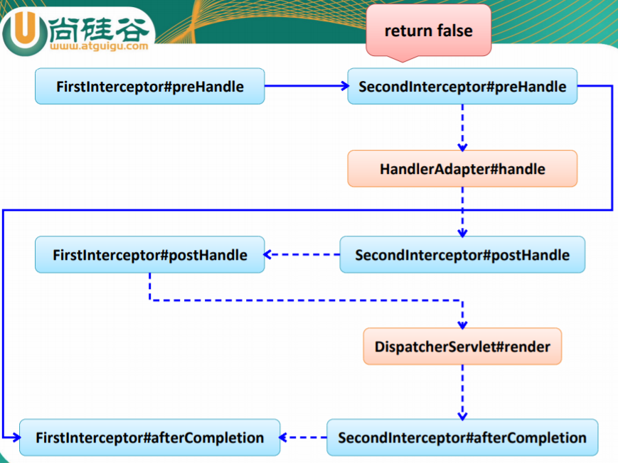

# 处理异常

1. Spring MVC通过HandlerExceptionResolver处理程序的异常，包括Handler映射、数据绑定以及目标方法执行时发生的异常。
2. Spring MVC提供的HandlerExcpetionResolver的实现类

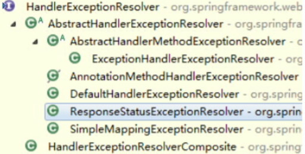

## HandlerExceptionResolver

1. DispatcherServlet默认装配的HandlerExceptionResolver:
   1. 没有使用 \<mvc:annotation-driven/>配置：
   2. 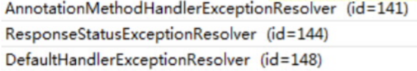
   3. 使用了\<mvc:annotation-driven/>配置：
   4. 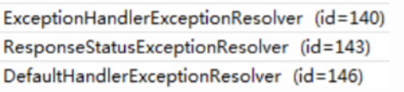

## ExceptionHandlerExceptionResolver

1. 主要处理Handler中用@ExceptionHandler注解定义方法
2. @ExceptionHandler注解定义的方法优先级问题：例如发生的是NullPointerException，但是声明的异常有RuntimeException和Exception，这时会根据异常的最近继承关系找到集成深度最浅的那一个 @ExceptionHandler注解方法，即标注了RuntimeExcpetion的方法。
3. ExceptionHandlerMethodResolver内部若找不到@ExceptionHandler注解的话，会找@ControllerAdvice中的@ExceptionHandler注解方法

## ResonseStatusExceptionResolver

1.  在异常及异常父类中找到 @ResponseStatus 注解，然 后使用这个注解的属性进行处理。 

2.  定义一个 @ResponseStatus 注解修饰的异常类 

3. ```java
   @ResponseStatus(HttpStatus.UNATHORIZED)
   public class UnathorizedException extends RuntimeException{}
   ```

4.  若在处理器方法中抛出了上述异常 : 若ExceptionHandlerExceptionResolver 不解析述异常。由于 触发的异常 UnauthorizedException 带有@ResponseStatus 注解。因此会被ResponseStatusExceptionResolver 解析 到。最后响应HttpStatus.UNAUTHORIZED 代码给客户 端。HttpStatus.UNAUTHORIZED 代表响应码401，无权限。 关于其他的响应码请参考 HttpStatus 枚举类型源码。 

##  DefaultHandlerExceptionResolver 

> 对一些特殊的异常进行处理，比 如NoSuchRequestHandlingMethodException、HttpReques tMethodNotSupportedException、HttpMediaTypeNotSuppo rtedException、HttpMediaTypeNotAcceptableException 等。 

##  SimpleMappingExceptionResolver 

>  如果希望对所有异常进行统一处理，可以使用 SimpleMappingExceptionResolver，它将异常类名映射为 视图名，即发生异常时使用对应的视图报告异常 

```xml
<bean id="simpleMappingExceptionResolver" class="org.springframework.web.servlet.handler.SimpleMappingExceptionResolver">
	<property name="exceptionMappings">
    	<props>
        	<prop key="java.lang.ArithmeticException">error</prop>
        </props>
    </property>
</bean>
```

# SpringMVC 运行流程

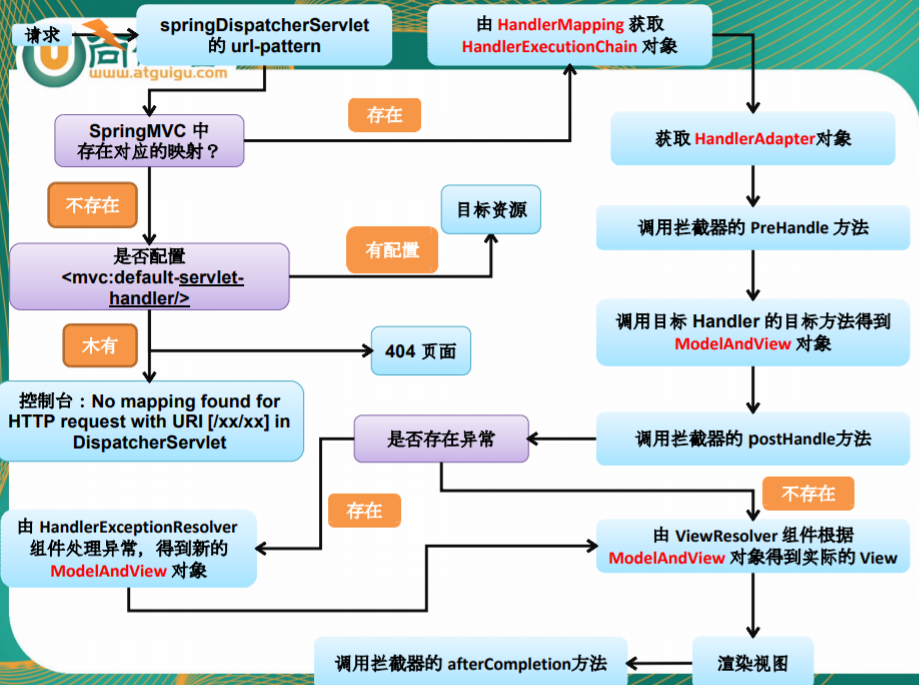


# 在Spring的环境下使用Spring MVC

## Bean被创建两次

> Spring 的IOC容器不应该扫描Spring MVC中的bean,对应的Spring MVC的IOC容器不应该扫描Spring 的bean

```xml
<!--配置注解扫描器-->
<context:component-scan base-package="com.zh.springmvc" use-default-filters="false">
    <context:include-filter type="annotation"
                            expression="org.springframework.stereotype.Controller"/>
    <context:include-filter type="annotation"
                            expression="org.springframework.web.bind.annotation.ControllerAdvice"/>
</context:component-scan>

<context:component-scan base-package="com.zh.springmvc">
    <context:exclude-filter type="annotation"
                            expression="org.springframework.stereotype.Controller"/>
    <context:exclude-filter type="annotation"
                            expression="org.springframework.web.bind.annotation.ControllerAdvice"/>
</context:component-scan>
```

## 在Spring MVC配置文件中引用业务层的Bean

1. 多个Spring IOC容器之间可以设置为父子关系，以实现良好的解耦。
2. Spring MVC WEB层容器可作为“业务层”Spring 容器的子容器：即WEB层容器可以引用业务层容器的Bean，而业务层容器却访问不到WEB层容器的Bean

